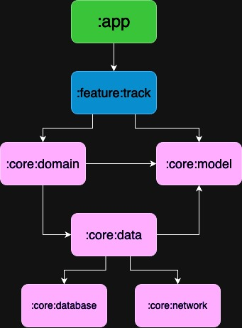

Album
==================

Le but de ce projet est d'afficher une liste de titres d'albums pour un test technique proposé par leboncoin

Architecture & modularisation
==================

L'architecture mise en place sur ce projet est inspirée de [Now in Android](https://developer.android.com/series/now-in-android).

J'ai utilisé ici la clean architecture + le pattern MVVM.

Le but de la clean architecture est de séparer le code en plusieurs couches pour avoir une séparation des préoccupations et un code plus **maintenable** et **testable**.  
Ces couches sont réparties en plusieurs modules (voir la section Module plus bas).

Par exemple, le module `:app` a accès aux sous-modules de `:feature` mais ne pourra pas utiliser le module `:core:network` pour faire des requêtes réseaux ni même `:core:database` pour faire des opérations avec la base de données.  
C'est seulement le module `:core:data` qui peut utiliser ces derniers, pour récupérer les données et les transformer si besoin.  
Après ça, le module `:core:domain` récupérera ces données et les distribuera aux sous-modules de `:feature` sous forme de usecase.
Enfin, les sous-modules de `:feature` s'occuperont de l'affichage de l'UI.

Le pattern MVVM est utilisé quant à lui du côté de la couche "presentation" en fournissant à la vue (Compose) des flux de données (flow) que cette dernière va observer et utiliser.

Modules
==================

* `:app` : Point de départ de l'app, c'est ici que l'on va gérer les thèmes, la navigation, etc.
* `:core` : Module parent où se trouvent plusieurs modules qui font partie, pour la plupart, de la couche domain et data de la clean archi 
* `:core:data` : C'est ici que l'on va récupérer des données de divers sources comme database et network
* `:core:database` : Module destiné à la gestion de la base de données pour les données que l'on veut garder en local
* `:core:domain` : Module regroupant tous les usecases de l'app (ex : `GetTracksUseCase.kt`)
* `:core:model` : Contient des classes métier que l'on va utiliser dans toute l'app (ex : `Track.kt)
* `:core:network` : Module destiné aux appels réseaux, c'est ici que l'on va faire appel à Retrofit par exemple
* `:feature` : Module parent où se trouve les fonctionnalités et parcours utilisation de l'app 
* `:feature:track` : Module où se trouve la page affichant une liste de titres d'albums

Schéma :

Libs
==================

* **Coroutines** : utilisé pour écrire du code asynchrone et non bloquant de manière simple et lisible. Il comprend également l'API `flow` qui permet de manipuler des flux de données asynchrones.
* **Retrofit** : utilisé pour faire de la communication réseau en envoyant des requêtes HTTP et en gérant les réponses 
* **Hilt** : utilisé pour faire de l'injection de dépendances et rendre ainsi le code plus modulaire, plus propre et plus facilement testable et maintenable
* **Room** : utilisé pour garder des données structurées en local dans une base de données, utile pour utiliser l'app en mode offline
* **Compose** : utilisé pour créer des interfaces utilisateur déclaratives, avec ça on peut produire moins de code pour faire de l'UI, avoir de meilleures performances, avoir une preview par state, écrire en kotlin, etc.
* **kotlinx-serialization-json** : utilisé pour sérialiser et désérialiser des données en JSON 
* **koil** : utilisé pour charger et afficher des images de façon optimale avec l'aide de coroutines ainsi que la mise en cache de ces images

Plugins 
==================

**ksp** : Alternative à kapt. KSP analyse le code en Kotlin code directement, ce qui permet d'effectuer l'analyse 2 fois plus rapidement